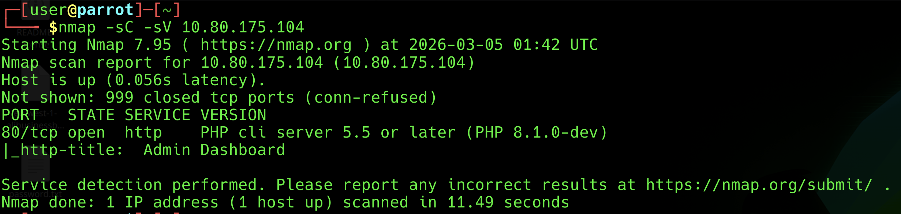
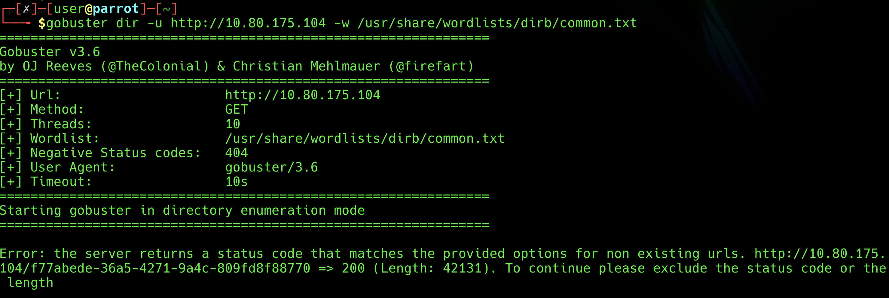
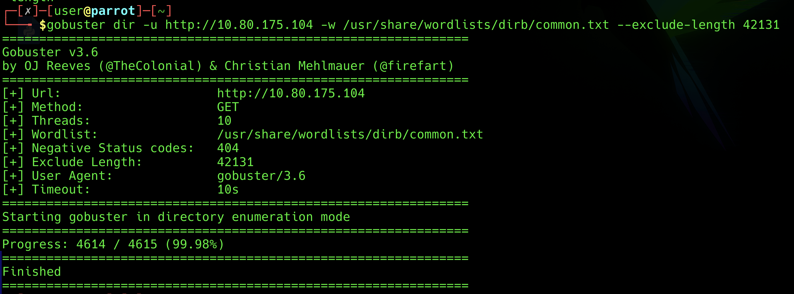
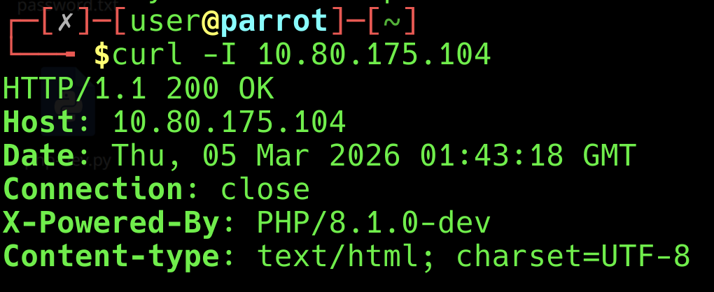
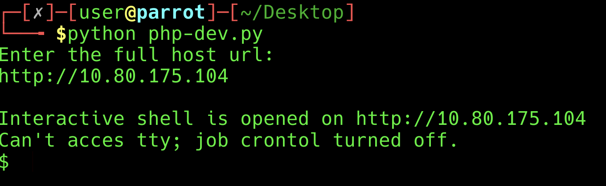
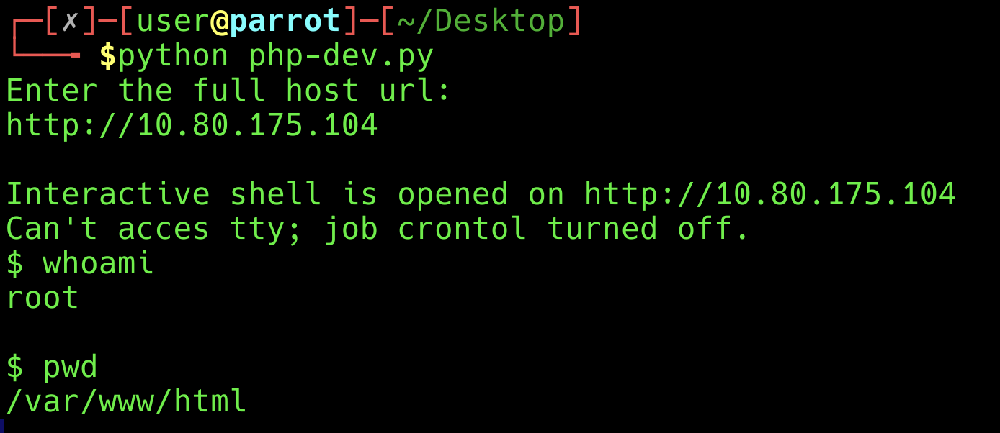
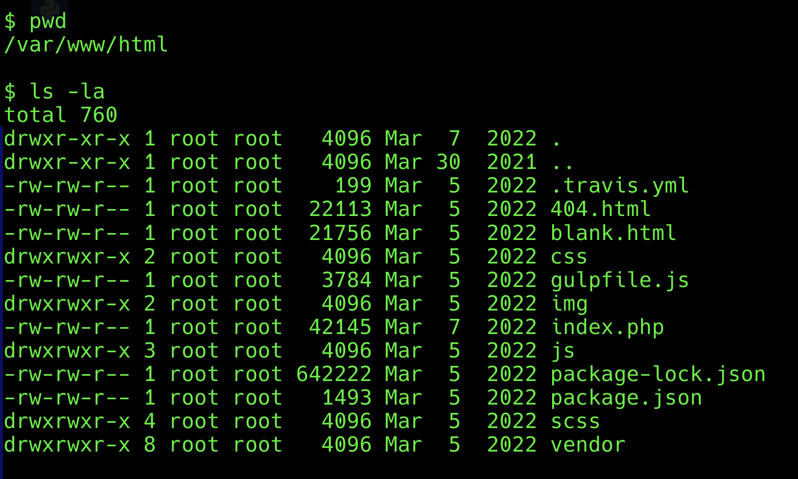
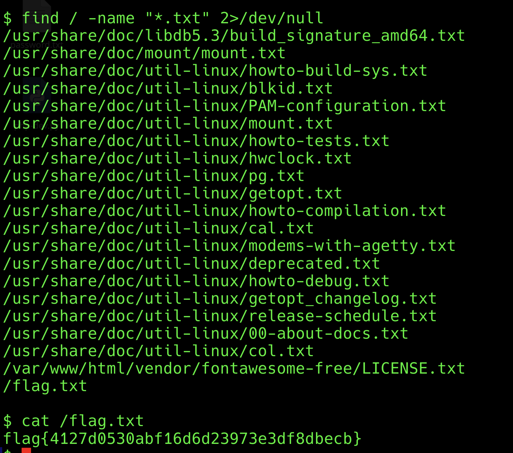

# Hack The Box – Agent T Write-Up

**Author:** Ali Bourak  
**Platform:** Hack The Box  
**Machine:** Agent T  
**Difficulty:** Easy  
**Date:** March 2026  

---

## Objective

Enumerate the target, identify a vulnerability, gain command execution, and retrieve the flags.

---

## Target

- **IP:** 10.80.175.104
- **Entry point:** HTTP (port 80)

---

## 1) Reconnaissance (Nmap)

I started with a service/version scan to identify exposed services.

```bash
nmap -sC -sV 10.80.175.104
```

**Finding:** Port 80/tcp (HTTP) was open.



---

## 2) Web Enumeration

I visited the web server in the browser:

- http://10.80.175.104/

The page loaded an Admin Dashboard-style site that looked mostly static.


---

## 3) Content Discovery (Gobuster)

I attempted directory brute forcing:

```bash
gobuster dir -u http://10.80.175.104 -w /usr/share/wordlists/dirb/common.txt
```



Gobuster returned an error because the server responded with HTTP 200 even for non-existing URLs, with a consistent response length (~42131 bytes / 42.13KB). To handle this, I excluded that length:

```bash
gobuster dir -u http://10.80.175.104 -w /usr/share/wordlists/dirb/common.txt --exclude-length 42131
```

This completed without returning useful results.



---

## 4) HTTP Header Inspection (curl -I)

Since the site content looked static, I checked the HTTP response headers to identify backend technology.

```bash
curl -I http://10.80.175.104
```

This revealed an important header:

- **X-Powered-By:** PHP/8.1.0-dev



---

## 5) Vulnerability Identification

The version **PHP/8.1.0-dev** is a strong clue. The **-dev** suffix means it is a *development* build—meant for testing, not for production servers. Seeing it on a live site suggests the server was misconfigured or never updated after development.

I looked up this version and found that it is linked to a **known backdoor**. A backdoor is hidden code that lets someone run commands on the server without going through normal login. In this case, the backdoor can be triggered via a special HTTP header, which would give **remote command execution** (RCE)—meaning we could run commands on the target machine from our own machine. That made this version a clear path to compromise, so I moved on to finding and using an exploit.

---

## 6) Exploitation

I went on [Exploit-DB](https://www.exploit-db.com/exploits/49933) and searched for the PHP 8.1.0-dev vulnerability. I found an exploit script, then on my virtual machine I created a `.py` file and based it on the script I had read. I entered the target IP address, ran it, and it gave me access to the backdoor. The script sends commands through a crafted HTTP header and returns command output, giving an interactive prompt.

Once the script was running, it provided a `$` prompt where commands could be executed remotely. To confirm execution:

```bash
whoami
```

The output showed: **root**





---

## 7) Post-Exploitation Enumeration

With command execution confirmed, I verified the working directory and listed files:

```bash
pwd
ls -la
```

This showed the web directory contents (e.g., index.php, 404.html, vendor/, css/, js/, etc.).



---

## 8) Flag Discovery

The standard locations (/home, /root) were empty in this box, so I searched the filesystem for text files:

```bash
find / -name "*.txt" 2>/dev/null
```

After locating the flag file, I displayed it with:

```bash
cat /path/to/flag.txt
```



---

## Conclusion

This machine highlighted the importance of enumeration beyond what is visible in the browser. Although the page appeared static, inspecting response headers exposed the backend version PHP/8.1.0-dev, which pointed to a known backdoor vulnerability and led to remote command execution and full compromise.